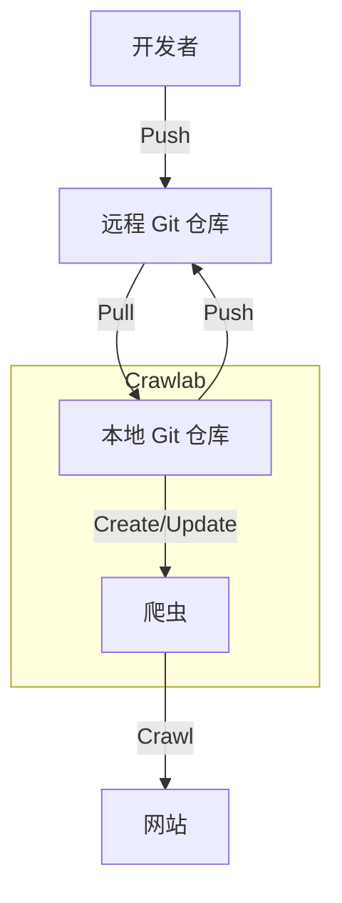

# 版本控制

:::info
Git 版本控制仅在 **Crawlab Pro** 中可用。
:::

您可以将版本控制系统 [Git](https://git-scm.com/) 集成到 Crawlab 以实现团队协作、版本控制和 CI/CD。通过 Git 集成，您可以在一个地方管理您的 Git 仓库和爬虫。这将极大地帮助团队协作和版本控制，并最终提高您的开发效率。

## Git 仓库管理

Crawlab 支持基本的 Git 仓库管理。您可以在 Git 仓库中创建、切换分支、拉取代码、推送代码和编辑代码。

### 克隆 Git 仓库

如果您有现有的 Git 仓库，可以通过以下步骤将其克隆到 Crawlab。

1. 导航到 `Git Repo` 列表页面。
2. 点击 `New Git Repo` 按钮。
   
3. 输入 Git 仓库的 URL，系统会检测它是 HTTPS 还是 SSH。
4. 输入 Git 仓库的用户名和密码或 SSH 密钥。
5. 点击 `确认` 按钮。
6. 系统将开始克隆 Git 仓库。
   
7. 等待仓库准备就绪。

### 切换分支

有时您可能希望为您的爬虫使用非默认分支。您可以通过以下步骤切换到不同的分支。

1. 导航到 `Git Repo` 列表页面。
2. 等待其准备就绪后导航到 Git 仓库详细页面。
3. 在操作栏中间点击分支选择下拉菜单。
   
4. 选择要切换到的分支。
5. 等待分支切换完成。

### 拉取代码

如果远程仓库有新的提交，您可以通过点击 `Changes` 标签页中的 `Pull` 按钮来拉取最新代码到 Crawlab。

### 编辑代码

您可以在 `Files` 标签页中编辑代码。这与爬虫详情页面中的 [代码编辑器](../file-editor/index.md) 类似。

### 提交/回滚更改

一旦您对代码进行了更改，您可以像在 Git 仓库中一样提交/回滚更改。

1. 转到 `Changes` 标签页。
2. 选择要提交/回滚的文件。
3. 点击 `Commit` 或 `Rollback` 按钮并确认。
4. 系统将在本地 Git 仓库中提交/回滚更改。
   
5. 您还可以通过点击要查看的文件的 `Show Diff` 按钮来查看更改的差异。
   

### 推送代码

您可以通过点击分支选择下拉菜单中的 `Push` 按钮或 `Changes` 标签页中的 `Push` 按钮来将更改推送到远程仓库。

### 查看 Git 提交

您可以通过点击 `Commits` 标签页来查看 Git 提交（日志）。

## Git 集成

Crawlab 的 Git 集成允许您从 Git 仓库创建和管理爬虫，从而实现在多爬虫项目的版本控制和团队协作。

### 创建爬虫

您可以创建一个链接到 Git 仓库的爬虫。

1. 导航到 `Git Repo` 详细页面。
2. 点击 `Create Spider` 按钮。
3. 输入爬虫所需的信息。
   
4. 点击 `确认` 按钮。
5. 创建的爬虫可以在 `Spiders` 标签页中查看。

或者，您也可以从 `Files` 标签页创建爬虫。

1. 导航到 `Git Repo` 详细页面。
2. 导航到 `Files` 标签页。
3. 右键单击要从中创建爬虫的目录并选择 `Create Spider`。
   
4. 输入爬虫所需的信息。

### 爬虫同步

当您在 Git 仓库中更改代码时，无需手动更新爬虫。Crawlab 将自动同步爬虫以获取 Git 仓库中的最新代码。

## 典型工作流程

Crawlab 中的典型 Git 集成工作流程如下图所示。

如您所见，工作流程非常简单。您可以从本地 Git 仓库创建/更新爬虫，然后由 Crawlab 服务器进行爬取。您还可以从 Crawlab 拉取远程 Git 仓库的最新代码到本地 Git 仓库，并在 Crawlab 中编辑代码后将更改推送到远程 Git 仓库。