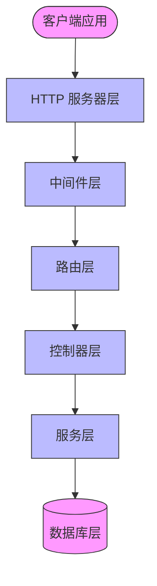
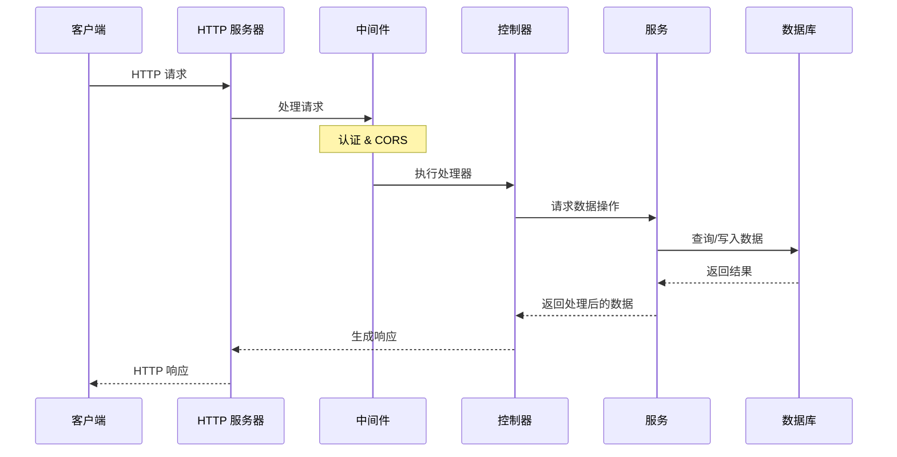
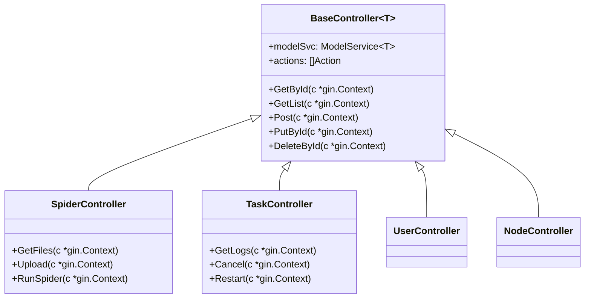
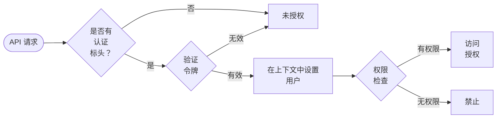

## API 引擎

Crawlab API 引擎为管理与交互 Crawlab 平台的组件提供了一个 RESTful 接口。基于 Gin Web 框架构建，它遵循结构化设计，包含控制器、中间件和实用工具，以促进清晰、可维护和可扩展的 API 端点。

## 架构

API 引擎遵循分层架构，并有明确的关注分离：



### 关键组件

1. **HTTP 服务器层**：
   - 处理 HTTP 连接、请求路由和中间件集成
   - 在 `apps` 包中的 `Api` 结构体中实现
   - 管理生命周期事件（初始化、启动/停止）

2. **中间件层**：
   - 在请求到达控制器之前处理请求
   - 处理跨切关注点，如认证、CORS 和日志记录
   - 在 `middlewares` 包中定义

3. **路由层**：
   - 将 HTTP 路由映射到控制器处理器
   - 按认证要求组织端点
   - 在 `controllers/router.go` 文件中实现

4. **控制器层**：
   - 实现 API 端点处理器和业务逻辑
   - 使用通用基控制器进行常见操作
   - 特定资源的专用控制器（爬虫、任务等）

5. **服务层**：
   - 提供数据访问和领域逻辑操作
   - 抽象数据库操作
   - 实现业务规则

6. **数据库层**：
   - MongoDB 存储持久化数据
   - 文件系统存储爬虫代码及相关资产

## 请求处理流程

以下序列图说明了请求如何流经系统：



### 处理步骤

1. **请求接收**：服务器接收一个传入的 HTTP 请求
2. **中间件处理**：
   - 应用 CORS 标头
   - 验证认证令牌
   - 将用户信息附加到请求上下文
3. **控制器执行**：
   - 提取并验证参数
   - 通过服务层执行业务逻辑
   - 准备适当的响应
4. **响应生成**：
   - 使用标准化 JSON 格式
   - 确定成功/错误状态
   - 一致地格式化数据负载

## 控制器系统

Crawlab 使用一个通用控制器系统，为所有资源提供标准化的 CRUD 操作：

### 基控制器

`BaseController` 是一个泛型类型，处理常见操作：

```go
type BaseController[T any] struct {
    modelSvc *service.ModelService[T]  // 数据服务
    actions  []Action                  // 自定义动作
}
```

它提供了以下实现：
- `GetById`：通过 ID 获取特定资源
- `GetList`：获取分页资源列表
- `Post`：创建新资源
- `PutById`：更新特定资源
- `PatchList`：批量更新资源
- `DeleteById`：删除特定资源
- `DeleteList`：批量删除资源

### 控制器层次结构

专用控制器通过资源特定的操作扩展基控制器：



## 认证系统

认证是 API 引擎的关键组件，为受保护资源提供安全性：

### 认证流程



### 实现细节

认证系统支持：

1. **承载令牌认证**：
   - Authorization 标头中的 JWT 风格令牌
   - 令牌携带用户身份和声明
   - 在 `middlewares.AuthorizationMiddleware()` 中实现

2. **同步认证**：
   - 用于节点同步的特殊认证
   - 使用应用程序认证密钥
   - 在 `middlewares.SyncAuthorizationMiddleware()` 中实现

3. **基于角色的访问控制**：
   - 用户分配角色（管理员、普通用户）
   - 权限由角色决定
   - 通过权限控制资源访问

## 路由系统和 API 结构

路由系统按认证要求和资源类型组织端点：

### 路由组

```go
type RouterGroups struct {
    AuthGroup      *gin.RouterGroup // 需要认证
    SyncAuthGroup  *gin.RouterGroup // 特殊同步认证
    AnonymousGroup *gin.RouterGroup // 无需认证
}
```

### API 资源类别

Crawlab 的 API 组织成几个逻辑资源类别：

1. **认证**：
   - `POST /login`：用户认证
   - `GET /me`：当前用户信息

2. **用户与项目**：
   - `GET/POST/PUT/DELETE /users`：用户管理
   - `GET/POST/PUT/DELETE /projects`：项目组织

3. **爬虫**：
   - `GET/POST/PUT/DELETE /spiders`：爬虫管理
   - `GET /spiders/:id/files`：爬虫文件列表
   - `POST /spiders/:id/run`：运行爬虫

4. **任务**：
   - `GET/POST /tasks`：任务管理
   - `GET /tasks/:id/logs`：任务日志检索
   - `POST /tasks/:id/cancel`：取消运行中的任务

5. **定时任务**：
   - `GET/POST/PUT/DELETE /schedules`：定时任务管理
   - `POST /schedules/:id/enable`：启用定时任务

6. **节点**：
   - `GET /nodes`：节点列表
   - `POST /nodes/:id/enable`：启用节点

## 响应处理

API 使用标准化响应格式以保持一致性：

### 响应结构

```go
type Response struct {
    Status  string      `json:"status"`   // 所有响应均为 "ok"
    Message string      `json:"message"`  // "success" 或 "error"
    Data    interface{} `json:"data"`     // 成功的负载
    Error   string      `json:"error"`    // 错误消息
}

type ListResponse struct {
    Status  string      `json:"status"`
    Message string      `json:"message"`
    Total   int         `json:"total"`    // 分页总数
    Data    interface{} `json:"data"`     // 项目数组
    Error   string      `json:"error"`
}
```

### 响应生成

辅助函数确保一致的响应格式：
- `HandleSuccess`：通用成功响应
- `HandleSuccessWithData`：带数据负载的成功响应
- `HandleSuccessWithListData`：带分页列表的成功响应
- `HandleErrorBadRequest`：400 错误请求响应
- `HandleErrorUnauthorized`：401 未授权响应
- `HandleErrorForbidden`：403 禁止响应
- `HandleErrorNotFound`：404 未找到响应
- `HandleErrorInternalServerError`：500 内部服务器错误响应

## 错误处理

API 实现了全面的错误处理策略：

1. **验证错误**：
   - 返回 400 错误请求并附带验证详细信息
   - 示例：缺少必填字段、格式无效

2. **认证错误**：
   - 返回 401 未授权并附带错误消息
   - 示例：无效或过期令牌

3. **权限错误**：
   - 返回 403 禁止并附带错误消息
   - 示例：操作权限不足

4. **未找到错误**：
   - 返回 404 未找到并附带错误消息
   - 示例：指定 ID 的资源不存在

5. **服务器错误**：
   - 返回 500 内部服务器错误并附带详细信息
   - 仅在开发模式下显示调试信息

## 可扩展性

API 引擎设计为可扩展：

1. **通用控制器**：
   - 轻松创建新的资源端点
   - 使用 Go 泛型进行类型安全操作

2. **自定义动作**：
   - 向控制器添加非标准操作
   - 通过 `actions` 参数注册：
   ```go
   RegisterController(groups.AuthGroup, "/spiders", NewController[models.Spider]([]Action{
       {
           Method:      http.MethodGet,
           Path:        "/:id/files",
           HandlerFunc: GetSpiderFiles,
       },
       // 更多自定义动作...
   }...))
   ```

3. **中间件注册**：
   - 自定义请求处理
   - 跨切关注点

## 服务器配置

HTTP 服务器配置有合理的默认值，可以进行自定义：

- **地址**：可配置主机和端口（默认：0.0.0.0:8000）
- **TLS**：可选 TLS 配置以支持 HTTPS
- **超时**：
   - 读取超时：30 秒
   - 写入超时：30 秒
   - 空闲超时：120 秒

## 性能考虑

API 引擎包括多个优化措施：

1. **请求分页**：
   - 限制大型结果集
   - 可配置的页面大小和数量

2. **数据库查询优化**：
   - 高效的 MongoDB 查询构建
   - 利用索引

3. **上下文取消**：
   - 正确处理客户端断开连接
   - 清理资源

## 安全考虑

安全性是 API 引擎的主要关注点：

1. **基于令牌的认证**：
   - JWT 或类似令牌验证
   - 无状态设计

2. **基于角色的访问控制**：
   - 操作的权限验证
   - 最小特权原则

3. **输入验证**：
   - 严格的请求验证
   - 防止注入攻击

4. **错误信息限制**：
   - 仅在开发模式下显示详细错误
   - 生产模式下使用通用错误消息

## 结论

Crawlab API 引擎为与 Crawlab 平台交互提供了一个强大、一致且可扩展的接口。其良好的结构设计便于维护和演进，而其安全功能确保资源得到适当保护。标准化的响应格式和错误处理为 API 消费者提供了统一的体验。