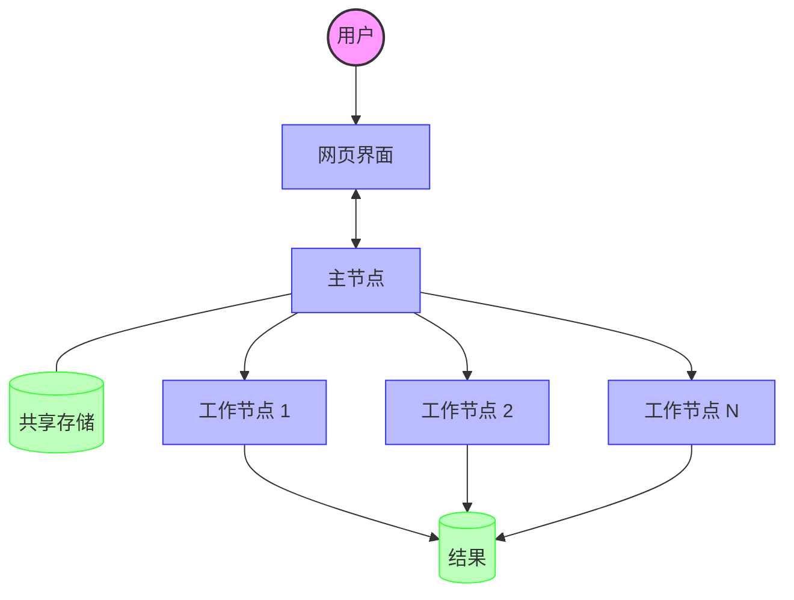
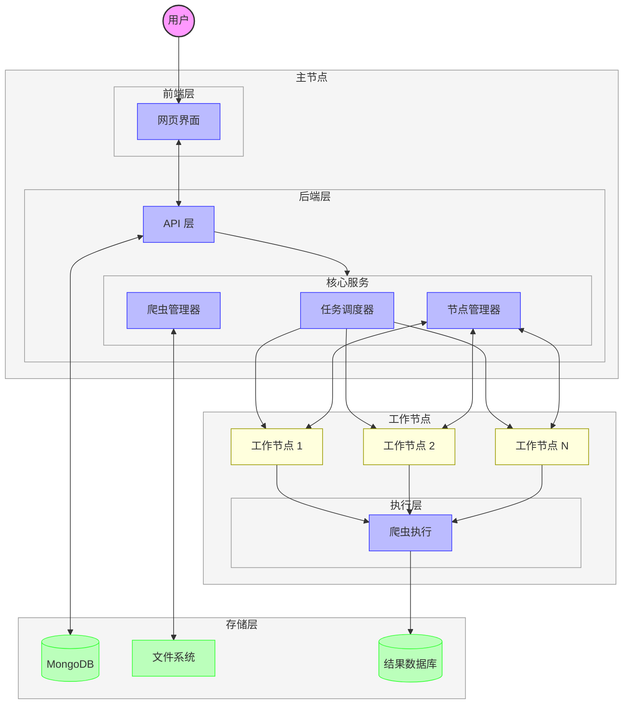

# 架构

## 介绍

Crawlab 是一个分布式网络爬虫管理平台，旨在帮助用户大规模管理和执行网络爬虫。本文档概述了 Crawlab 的架构，详细介绍了其核心组件、数据流和执行过程。

## 概念概述

在深入研究详细的架构之前，最好先从高层次的概念角度了解 Crawlab 如何工作。Crawlab 遵循主-从分布式架构模式（传统上称为 [master-slave 模式](https://en.wikipedia.org/wiki/Master%E2%80%93slave_(technology))）。

以下是概念架构图。

在这个简化视图中：
1. 用户通过网页界面与系统交互
2. 主节点协调所有活动并与工作节点通信
3. 工作节点执行实际的爬取任务
4. 共享存储层维护配置、代码和结果
5. 爬取的数据存储在结果数据库中

## 系统架构

Crawlab 架构由以下部分组成：

- **主节点**：跨工作节点协调和调度任务
- **工作节点**：执行爬取任务并将结果报告回主节点

## 核心组件

### 1. 网页界面
- 用户友好的仪表板，用于管理系统的各个方面
- 使用 Vue 3 + Vite 构建
- 提供任务状态、结果和系统指标的可视化

### 2. API 层
- 处理来自前端请求的 RESTful API 端点
- 用 Go 实现
- 管理身份验证和授权

### 3. 核心服务

#### 爬虫管理器
- 处理爬虫（爬取器）配置和代码管理
- 支持各种爬虫类型和语言
- 管理爬虫版本和部署

#### 任务调度器
- 调度和协调爬取任务
- 支持手动和基于 cron 的调度
- 处理任务优先级和队列管理

#### 节点管理器
- 在分布式系统中管理工作节点
- 处理节点注册、监控和健康检查
- 平衡可用节点上的任务负载

### 4. 数据模型

- **爬虫**：定义爬虫配置，包括命令、参数和数据存储
- **任务**：表示蜘蛛的执行实例，并跟踪状态
- **节点**：表示分布式系统中的工作机器
- **用户**：管理访问控制和身份验证
- **定时任务**：定义自动化任务执行的时间
- **项目**：将爬虫组织成逻辑组

### 5. 存储

- **MongoDB**：系统配置和元数据的主要数据库
- **结果数据库**：可配置的数据库，用于存储爬取的数据
- **文件系统**：存储爬虫代码、日志及相关文件

## 工作流程

### 基本工作流程

1. 用户通过网页界面创建/配置一个爬虫
2. 用户为爬虫安排任务（手动或通过 cron 调度）
3. 任务调度器将任务分配给可用的工作节点
4. 工作节点执行爬虫并将结果存储在配置的数据库中
5. 用户通过网页界面查看任务状态和结果

### 详细执行流程

1. **爬虫创建**：用户定义带有执行参数的爬虫
2. **任务调度**：任务通过手动或 cron 作业调度
3. **任务分发**：主节点将任务分配给可用的工作节点
4. **任务执行**：工作节点运行爬虫进程
5. **结果收集**：爬取的数据存储在配置的数据库中
6. **监控**：实时监控任务状态和性能

## 可扩展性功能

- **分布式架构**：主-从模型允许水平扩展
- **动态节点管理**：可以在不停机的情况下添加或移除节点
- **任务优先级**：基于优先级的任务执行
- **资源控制**：控制每个节点的运行器数量以管理资源利用率

## 使用的技术

- **后端**：Go (Golang)
- **数据库**：MongoDB 用于元数据和配置
- **API 通信**：REST 和 gRPC
- **前端**：Vue.js
- **部署**：支持 Docker 用于容器化部署

## 结论

Crawlab 提供了一个强大的平台，用于管理具有分布式执行能力的网络爬虫。其模块化设计允许在部署中进行扩展和灵活性，而全面的管理功能则使有效监控和控制爬取操作成为可能。这种架构使得 Crawlab 适用于从小型个人项目到大型企业爬取需求的各种场景。