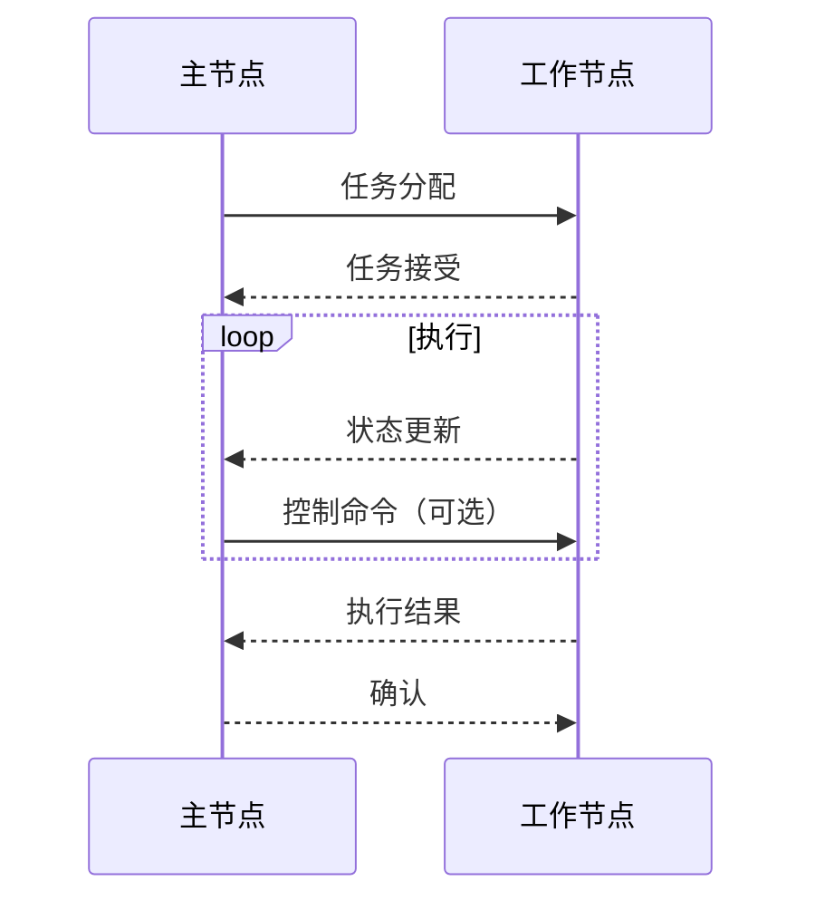
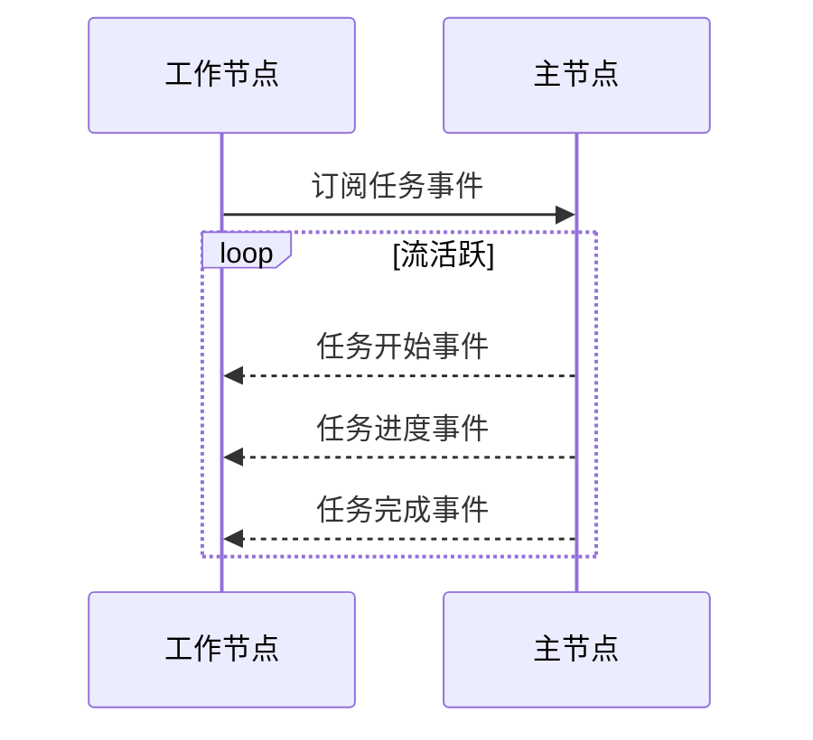
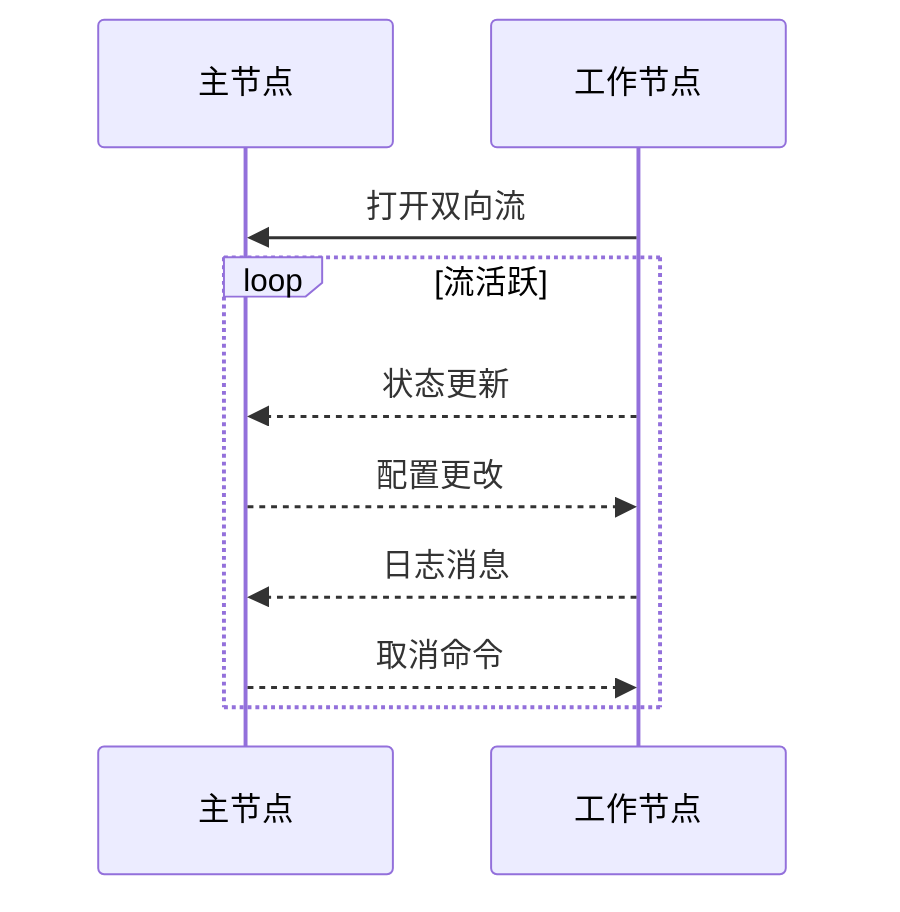

# 节点通信

## 简介

本文档详细介绍了Crawlab分布式架构中使用的通信机制。理解这些协议对于想要扩展Crawlab、排除通信问题或实现自定义集成的开发人员至关重要。

## 主从节点通信概述

Crawlab在主节点和工作节点之间采用双向通信模型。这种通信对于以下方面至关重要：

- 任务分配和协调
- 工作节点健康监控和管理
- 系统状态同步
- 结果收集和聚合



## gRPC 实现

### 为什么使用gRPC？

Crawlab出于以下几个原因将gRPC作为主节点和工作节点之间的主要通信协议：

- **性能**：二进制序列化比JSON/REST提供更好的性能
- **强类型**：Protocol Buffers强制消息结构
- **双向流式传输**：支持实时更新和命令流
- **语言无关性**：支持多种编程语言

### 服务定义

Crawlab的核心服务使用Protocol Buffers（.proto文件）定义：

#### 任务gRPC服务：

```protobuf
service TaskService {
  rpc Subscribe(TaskServiceSubscribeRequest) returns (stream TaskServiceSubscribeResponse){};
  rpc Connect(stream TaskServiceConnectRequest) returns (Response){};
  rpc FetchTask(TaskServiceFetchTaskRequest) returns (TaskServiceFetchTaskResponse){};
  rpc SendNotification(TaskServiceSendNotificationRequest) returns (Response){};
}
```

#### 节点gRPC服务：

```protobuf
service NodeService {
  rpc Register(NodeServiceRegisterRequest) returns (Response){};
  rpc SendHeartbeat(NodeServiceSendHeartbeatRequest) returns (Response){};
  rpc Subscribe(NodeServiceSubscribeRequest) returns (stream NodeServiceSubscribeResponse){};
}
```

### 连接管理

工作节点与主节点建立持久的gRPC连接，具有以下特性：

- **连接池**：工作节点维护连接池以优化资源使用
- **自动重连**：连接失败时尝试重新连接
- **TLS安全**：所有连接都通过TLS进行安全保护（当配置时）
- **连接元数据**：每个连接包含认证令牌和节点标识

## 流管理

Crawlab广泛使用gRPC流式传输以实现实时更新：

### 单向流式传输

用于事件通知，如任务状态更新：



### 双向流式传输

用于需要双向连续通信的场景：



## 错误处理和恢复

### 通信故障

系统实现了几种错误处理机制：

1. **自动重试**：失败的通信尝试会自动重试，并采用指数退避策略
2. **断路器**：重复失败会触发断路器以防止级联故障
3. **状态恢复**：重新连接后，状态会同步以恢复通信中断

## 结论

Crawlab的通信协议为分布式爬虫管理提供了坚实的基础。gRPC实现提供了性能和可靠性优势，而精心设计的消息模式确保了系统的弹性和可扩展性。

扩展Crawlab的开发人员应遵循这些已建立的模式以保持系统完整性和性能特征。