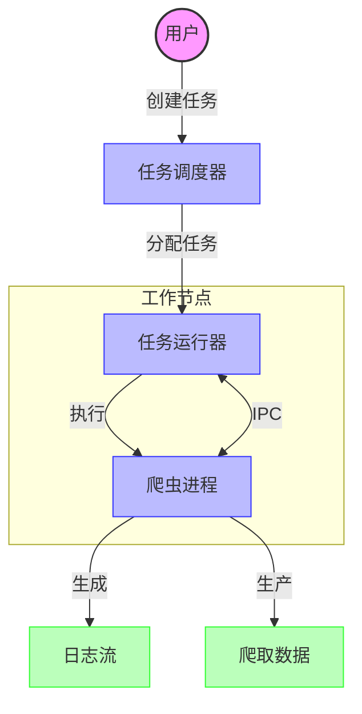

# 任务执行

## 简介

任务执行引擎是Crawlab的核心组件，负责高效可靠地在分布式系统中执行网络爬虫（爬虫）。本文档解释了任务从创建到完成的过程以及支持此过程的技术机制。

## 视觉概述



## 任务生命周期

在Crawlab中的一个爬虫任务会经历这些关键状态：

1. **已创建** → 任务使用配置参数初始化
2. **待处理** → 任务被调度并等待执行
3. **正在运行** → 任务在工作节点上积极执行
4. **已完成** → 任务成功完成
5. **错误** → 任务由于错误而失败
6. **已取消** → 任务由用户手动停止
7. **异常** → 任务进入需要恢复的意外状态

## 核心组件

### 1. 任务调度器

任务调度器管理任务的创建、优先级和在Crawlab集群中的分布。

#### 主要职责：
- **任务创建** - 从爬虫配置生成任务
- **队列管理** - 根据重要性对任务进行优先级排序
- **节点选择** - 将任务分配给适当的工作节点
- **任务跟踪** - 维护系统中所有任务的状态

#### 执行模式：
- **按需**：由用户手动触发
- **定时任务**：使用cron表达式自动触发
- **集群模式**：在多个节点上同时执行以实现分布式爬取

#### 任务分发策略：
- **随机**：将任务分配给随机选择的可用节点
- **指定节点**：将任务分配给用户选择的节点
- **所有节点**：在所有可用节点上并行执行任务

### 2. 任务运行器

任务运行器在工作节点上执行单个爬虫任务。每个运行器管理一个单独的任务进程，并处理其完整的生命周期。

#### 运行器生命周期：
1. **设置阶段**
   - 从数据库检索任务和爬虫详细信息
   - 与主节点建立通信通道
   - 如果在工作节点上运行，则同步爬虫文件
   - 如果需要，安装依赖项

2. **执行阶段**
   - 更新任务状态为“正在运行”
   - 使用适当的参数构建执行命令
   - 设置环境变量
   - 创建I/O管道用于与进程通信
   - 启动进程并监控执行

3. **监控阶段**
   - 捕获stdout/stderr输出用于日志记录
   - 处理进程间通信（IPC）消息
   - 实时更新任务统计信息
   - 处理取消请求

4. **完成阶段**
   - 确定最终任务状态
   - 更新任务统计信息
   - 发送完成通知
   - 释放资源

### 3. 进程间通信（IPC）

任务运行器通过双向JSON消息系统与爬虫进程通信：

#### 通信通道：
- **stdin**：发送到爬虫进程的命令
- **stdout**：来自爬虫的输出和结构化消息
- **stderr**：错误消息和调试信息

#### 消息结构：
```json
{
  "type": "MESSAGE_TYPE",
  "payload": { /* 消息数据 */ }
}
```

#### 关键消息类型：
- **INSERT_DATA**：爬虫发送爬取数据以存储
- **STATUS**：进程报告状态信息
- **ERROR**：进程报告错误条件
- **CANCEL**：运行器请求进程终止

### 4. 日志管理

引擎捕获和处理日志以供监控和调试：

- **实时流**：日志在产生时通过UI提供
- **持久存储**：日志存储用于历史分析
- **结构化日志**：日志条目可以包括元数据以便更好地过滤
- **日志轮转**：防止长时间运行的任务导致磁盘使用过度

### 5. 文件同步

对于分布式部署，爬虫文件必须在工作节点上可用：

- **按需同步**：任务分配时传输文件
- **差异同步**：仅传输更改的文件
- **版本控制**：支持同一爬虫的多个版本

## 性能优化

### 资源管理
- **并发控制**：每个节点具有可配置的最大并发运行器
- **内存限制**：任务可以有内存使用限制
- **运行时间限制**：可以强制执行最大执行时间

### 效率特性
- **结果批处理**：结果以批次形式发送以减少开销
- **日志缓冲**：日志在写入存储之前进行缓冲
- **文件缓存**：频繁使用的文件在工作节点上缓存

## 错误处理和恢复

### 强健的错误处理
- **错误分类**：区分系统、网络和爬虫错误
- **重试机制**：根据可配置策略自动重试失败的任务
- **优雅降级**：即使组件失败，系统仍保持运行

### 恢复策略
- **进程监控**：检测并处理崩溃的进程
- **节点故障恢复**：重新安排失败节点上的任务
- **孤儿任务检测**：识别并恢复卡住的任务

## 实现细节

任务执行引擎使用以下技术构建：
- **Go语言**：为了性能和并发性
- **gRPC**：为了高效的主-工作节点通信
- **MongoDB**：用于任务状态持久化
- **Docker支持**：用于隔离的执行环境

## 故障排除

### 常见问题
- **任务卡在“正在运行”**：通常表示进程崩溃或通信失败
- **文件同步失败**：检查主节点和工作节点之间的网络连接
- **高资源使用**：考虑调整并发设置

### 诊断工具
- **任务日志**：调试爬虫问题的主要来源
- **系统日志**：用于诊断系统级问题
- **节点状态**：指示工作节点的健康状况

## 结论

任务执行引擎为大规模运行网络爬虫提供了稳健且可扩展的基础。其模块化设计允许在保持可靠性和性能的同时灵活部署。